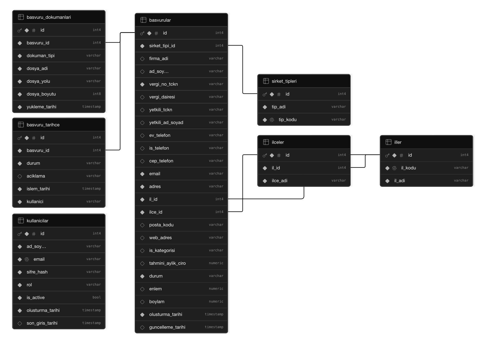
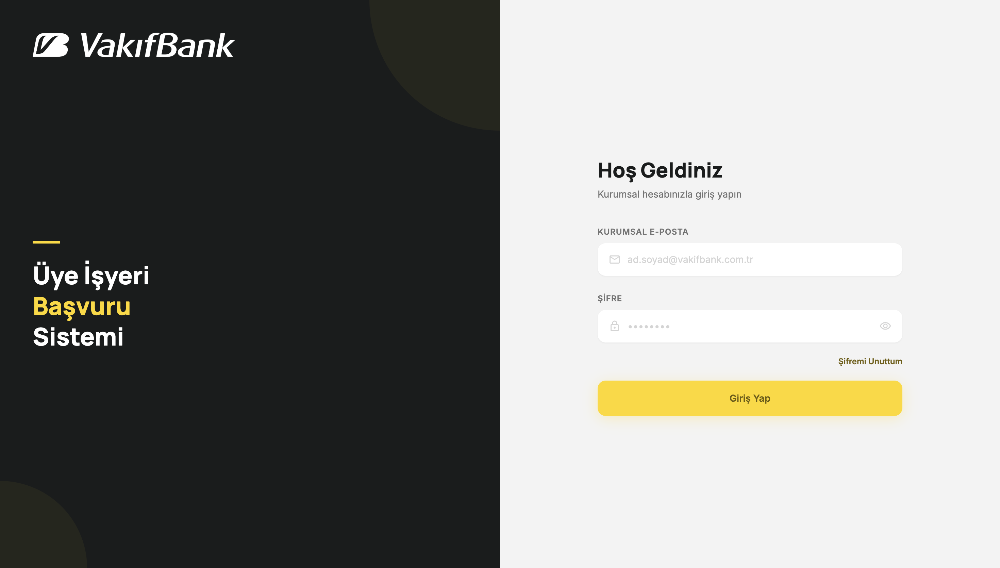
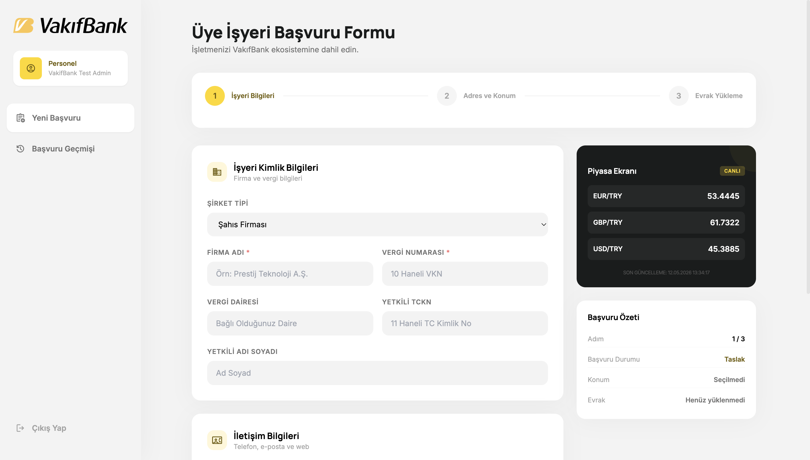
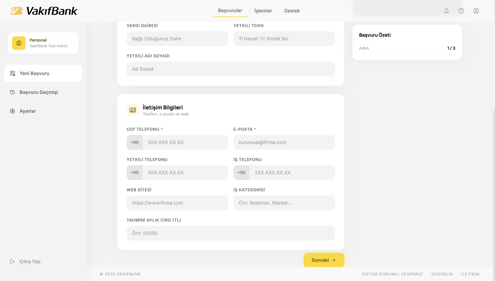
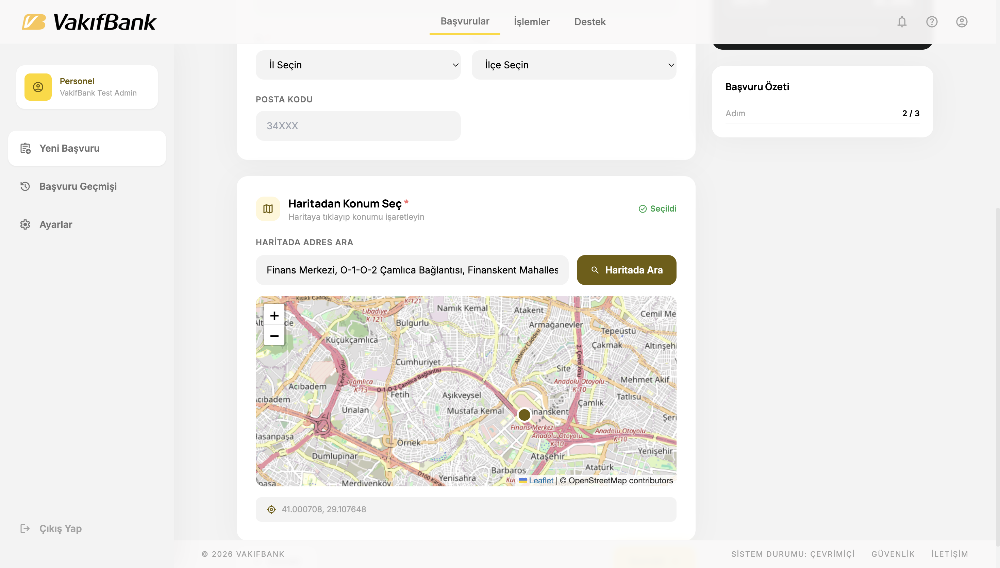
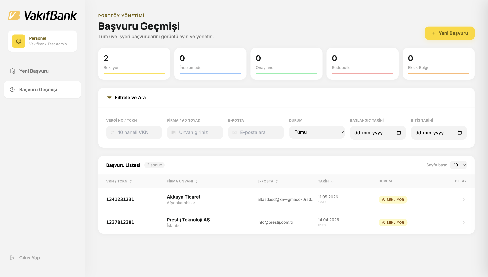
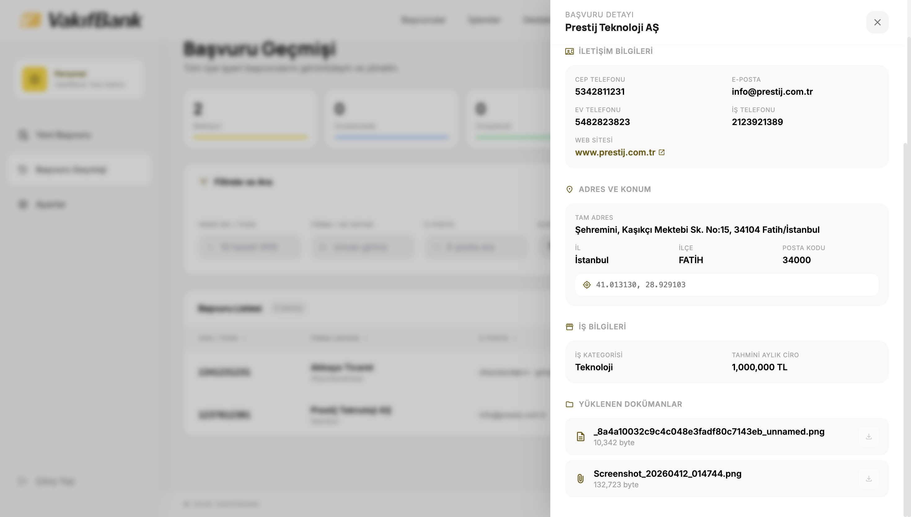
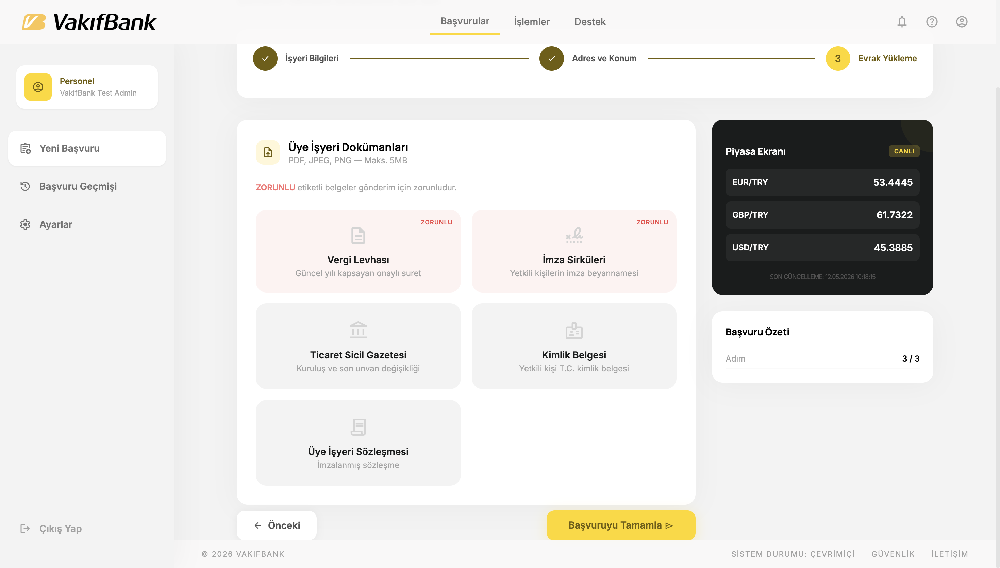

# VakıfBank Üye İşyeri Başvuru Sistemi

Kurumsal üye işyeri başvurularını dijital ortamda almak, dokümanları güvenli şekilde saklamak ve başvuru süreçlerini yönetmek için geliştirilmiş full-stack bir merchant onboarding uygulaması.

Bu proje, VakıfBank Ödeme Sistemleri Uygulama Geliştirme departmanında gerçekleştirdiğim staj sürecinde geliştirilmiş bir staj projesidir.

> Bu repo staj projesi sunumu, yerel teknik inceleme ve portfolyo/GitHub değerlendirmesi için hazırlanmıştır. Finalize edilmiş bir production ürünü değildir ve rol bazlı yetkilendirme, audit logging, rate limiting, monitoring, test kapsamı ve daha sıkı operasyonel güvenlik ile geliştirilebilir. Deployment kapsam dışıdır.

---

## Türkçe

### Proje Özeti

Uygulama, bir işletmenin üye işyeri başvurusu oluşturmasını, adres ve harita konumu seçmesini, gerekli belgeleri yüklemesini ve başvuruların yönetim panelinden incelenmesini sağlar. Backend tarafında ASP.NET Core Web API, frontend tarafında Angular kullanılır. Demo veritabanı ve doküman saklama altyapısı Supabase üzerinde çalışır.

### Öne Çıkan Özellikler

- JWT tabanlı giriş ve korumalı başvuru ekranları
- Üç adımlı başvuru formu
- FluentValidation ile backend tarafında merkezi validasyon yönetimi
- Vergi numarası, TCKN, telefon ve e-posta validasyonları
- OpenStreetMap + Leaflet ile harita üzerinden konum seçimi
- Nominatim ile adres arama ve ters geocoding
- PDF/PNG/JPG/JPEG doküman yükleme
- Supabase Storage private bucket kullanımı
- Doküman görüntüleme için backend tarafından üretilen signed URL
- Başvuru listeleme, filtreleme, sıralama ve detay paneli
- 2 günden fazla "Bekliyor" durumunda kalan başvuruları kontrol edip iptale çeken zamanlanmış job / Windows scheduled service mantığı
- Job’ın her 30 dakikada bir çalışacak şekilde planlanması
- Döviz kuru ekranı

### Teknoloji Yığını

| Katman | Teknolojiler |
|---|---|
| Backend | ASP.NET Core Web API, .NET 9, Entity Framework Core, FluentValidation, JWT |
| Frontend | Angular, TypeScript, RxJS, Tailwind CSS |
| Veritabanı | Supabase PostgreSQL |
| Dosya Saklama | Supabase Storage, private bucket, backend signed URL |
| Harita | OpenStreetMap, Leaflet |
| Geocoding | Nominatim |
| API Dokümantasyonu | Swagger / OpenAPI |

### Mimari

```text
Angular Frontend
  ├─ Login
  ├─ Başvuru Formu
  ├─ Harita ve Adres Seçimi
  └─ Başvuru Geçmişi
        │
        ▼
ASP.NET Core Web API
  ├─ Controllers
  ├─ Services
  ├─ Repositories
  ├─ Scheduled Job / Windows Scheduled Service Logic
  └─ Entity Framework Core
        │
        ├─ Supabase PostgreSQL
        └─ Supabase Storage (Private Bucket)
```

### Veritabanı ve Süreç Yapısı

Supabase PostgreSQL başvuru, kullanıcı, durum geçmişi ve doküman metadata kayıtlarını tutar. Yüklenen dosyaların fiziksel içeriği Supabase Storage içinde saklanır; PostgreSQL tarafında dosya adı, boyut, yükleme tarihi ve Supabase Storage object path bilgisi tutulur.



- `basvurular`: Ana üye işyeri başvuru tablosudur; firma, yetkili kişi, vergi, adres, koordinat, kategori, tahmini ciro, durum ve tarih bilgilerini saklar.
- `basvuru_dokumanlari`: Yüklenen doküman metadata bilgilerini ve Supabase Storage object path değerini saklar.
- `basvuru_tarihce`: Başvuruların durum geçmişini, açıklama, işlem tarihi ve kullanıcı bilgisiyle takip eder.
- `kullanicilar`: Uygulama kullanıcı ve giriş bilgilerini saklar.
- `sirket_tipleri`: Şirket tipi referans tablosudur.
- `iller`: İl referans tablosudur.
- `ilceler`: İlçe referans tablosudur ve `iller` ile ilişkilidir.

İlişki özeti:

- `basvurular -> basvuru_dokumanlari`
- `basvurular -> basvuru_tarihce`
- `basvurular -> sirket_tipleri`
- `basvurular -> iller / ilceler`
- `iller -> ilceler`

### Ekran Görüntüleri

Ekran görüntüleri `docs/screenshots/` klasörü altında yer almaktadır.

| Ekran | Görsel |
|---|---|
| Giriş |  |
| Başvuru Formu  |  |
| Başvuru Formu  |  |
| Harita Seçimi |  |
| Başvuru Listesi |  |
| Başvuru Detayı |  |
| Doküman Yükleme |  |


### Proje Yapısı

```text
back-end/          ASP.NET Core Web API
front-end/         Angular uygulaması
docs/screenshots/  GitHub README ekran görüntüleri
README.md          Ana proje dokümantasyonu
```

### Kurulum

#### 1. Repoyu Klonlayın

```bash
git clone https://github.com/berataltinsuyu/vakifbank-merchant.git
cd vakifbank-merchant
```

#### 2. Backend Konfigürasyonu

Backend Supabase PostgreSQL ve Supabase Storage kullanır. Teknik inceleme için yerel PostgreSQL kurulumu veya migration çalıştırma gerekmez. İnceleme için gerçek `back-end/appsettings.Local.json` dosyası özel olarak paylaşılır.

Örnek dosyayı kopyalayabilirsiniz:

```bash
cd back-end
cp appsettings.Local.example.json appsettings.Local.json
```

Ardından özel olarak paylaşılan gerçek değerleri `appsettings.Local.json` içine yerleştirin.

> `appsettings.Local.json` git tarafından ignore edilir. Gerçek connection string, Supabase service role key ve JWT secret hiçbir zaman commit edilmemelidir.

Backend'i çalıştırın:

```bash
dotnet restore
dotnet run
```

Backend ve frontend ayrı terminal pencerelerinde çalıştırılmalıdır.

Swagger varsayılan olarak geliştirme ortamında açıktır:

```text
http://localhost:5199/swagger
```

#### 3. Frontend Kurulumu

```bash
cd front-end
npm install
npm start
```

Angular uygulaması:

```text
http://localhost:4200
```

### Demo Giriş

Demo giriş bilgileri, teknik inceleme için paylaşılan `appsettings.Local.json` dosyasıyla birlikte özel olarak iletilecektir.

---

## English

### Project Overview

This project was developed as an internship project during my internship at VakıfBank in the Payment Systems Application Development Department.

This is a full-stack merchant onboarding application for collecting merchant applications, selecting business locations on a map, uploading required documents, and reviewing applications through an administrative interface. The backend is built with ASP.NET Core Web API, and the frontend is built with Angular. Supabase is used as the demo PostgreSQL database and private document storage infrastructure.

This repository is prepared for internship project presentation, local technical review, and portfolio/GitHub evaluation. It is not a finalized production product and can be further improved with role-based authorization, audit logging, rate limiting, monitoring, test coverage, and stricter operational security.

### Features

- JWT-based login and protected application screens
- Three-step merchant application form
- Centralized backend validation with FluentValidation
- Tax number, national ID, phone, and email validation
- Location selection with OpenStreetMap + Leaflet
- Address search and reverse geocoding with Nominatim
- PDF/PNG/JPG/JPEG document upload
- Private Supabase Storage bucket
- Backend-generated signed URLs for document viewing
- Application listing, filtering, sorting, and detail panel
- Scheduled background job / Windows scheduled service logic that checks applications remaining in "Pending" status for more than 2 days and automatically cancels them
- The job is planned to run every 30 minutes
- Currency rates page

### Technology Stack

| Layer | Technologies |
|---|---|
| Backend | ASP.NET Core Web API, .NET 9, Entity Framework Core, FluentValidation, JWT |
| Frontend | Angular, TypeScript, RxJS, Tailwind CSS |
| Database | Supabase PostgreSQL |
| Storage | Supabase Storage, private bucket, backend signed URLs |
| Maps | OpenStreetMap, Leaflet |
| Geocoding | Nominatim |
| API Docs | Swagger / OpenAPI |

### Architecture

```text
Angular Frontend
  ├─ Login
  ├─ Application Form
  ├─ Map and Address Selection
  └─ Application History
        │
        ▼
ASP.NET Core Web API
  ├─ Controllers
  ├─ Services
  ├─ Repositories
  ├─ Scheduled Job / Windows Scheduled Service Logic
  └─ Entity Framework Core
        │
        ├─ Supabase PostgreSQL
        └─ Supabase Storage (Private Bucket)
```

### Database and Process Structure

Supabase PostgreSQL stores application, user, status history, and document metadata records. Uploaded file contents are stored physically in Supabase Storage; PostgreSQL keeps the file name, file size, upload date, and Supabase Storage object path.


- `basvurular`: Main merchant application table; stores company, authorized person, tax, address, coordinates, category, estimated turnover, status, and date information.
- `basvuru_dokumanlari`: Stores uploaded document metadata and the Supabase Storage object path.
- `basvuru_tarihce`: Tracks application status history with description, action date, and user information.
- `kullanicilar`: Stores application user and login information.
- `sirket_tipleri`: Company type lookup table.
- `iller`: City lookup table.
- `ilceler`: District lookup table related to `iller`.

Relationship summary:

- `basvurular -> basvuru_dokumanlari`
- `basvurular -> basvuru_tarihce`
- `basvurular -> sirket_tipleri`
- `basvurular -> iller / ilceler`
- `iller -> ilceler`

### Screenshots

Screenshots are available under the `docs/screenshots/` folder.

| Screen | Image |
|---|---|
| Login |  |
| Application Form |  |
| Application Form |  |
| Map Selection |  |
| Application List |  |
| Application Detail |  |
| Document Upload |  |

### Project Structure

```text
back-end/          ASP.NET Core Web API
front-end/         Angular application
docs/screenshots/  GitHub README screenshots
README.md          Main project documentation
```

### Setup

#### 1. Clone the Repository

```bash
git clone https://github.com/berataltinsuyu/vakifbank-merchant.git
cd vakifbank-merchant
```

#### 2. Backend Setup

The backend uses Supabase PostgreSQL and Supabase Storage. For local technical review, no local PostgreSQL installation or migration step is required when the private `back-end/appsettings.Local.json` file is provided.

You can copy the example configuration:

```bash
cd back-end
cp appsettings.Local.example.json appsettings.Local.json
```

Then fill `appsettings.Local.json` with the real values shared privately for review.

> `appsettings.Local.json` is ignored by git. Real connection strings, Supabase service role keys, and JWT secrets must never be committed.

Run the backend:

```bash
dotnet restore
dotnet run
```

Backend and frontend should be started in separate terminal windows.

Swagger is available in development mode:

```text
http://localhost:5199/swagger
```

#### 3. Frontend Setup

```bash
cd front-end
npm install
npm start
```

Angular app:

```text
http://localhost:4200
```

### Demo Login

Demo login credentials will be shared privately together with the `appsettings.Local.json` file for technical review.
